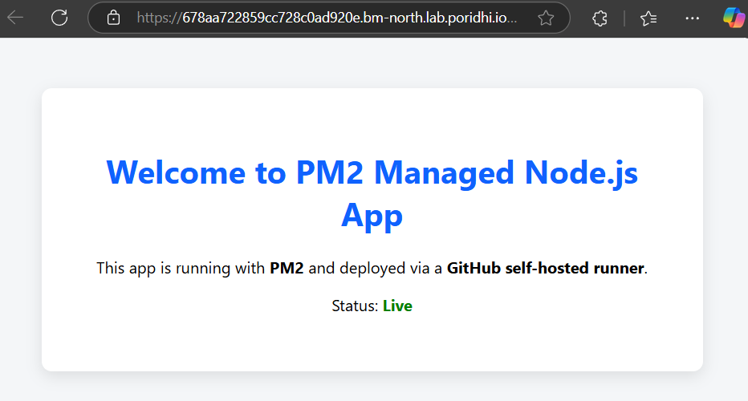

# 📘 Node.js Static Frontend App Deployment using PM2 and GitHub Self-hosted Runner

## Introduction

This project is a simple **Node.js application** that serves static frontend files (HTML, CSS) using Express. The app is deployed using **GitHub Actions** with a **self-hosted runner**, and managed with **PM2**, a process manager for Node.js.

---

## Tools Used and Their Purposes

### 1. PM2 (Process Manager 2)
- PM2 is a production-grade process manager for Node.js applications.
- It runs the app in the background, restarts it on failure, logs activity, and can manage multiple apps simultaneously.
- **Why used?**
  - Ensures the app stays alive after deployment.
  - Useful for monitoring and restarting the app automatically if it crashes.

### 2. Self-hosted GitHub Runner
- A self-hosted runner is a machine (local or server) where GitHub Actions workflows run.
- It gives full control over the environment.
- **Why used?**
  - To run workflows in a private environment (e.g., where PM2 is installed).
  - Cloud runners can’t persist processes like PM2 between runs, but self-hosted runners can.

---

## 📁 Project File Structure and Description

```bash
NodeApp_pm2/
├── .github/
│   └── workflows/
│       └── deploy.yml      # GitHub Actions workflow (CI/CD pipeline)
├── public/
│   ├── index.html          # Main HTML file (Frontend UI)
│   └── style.css           # CSS styling
├── .gitignore              # Ignored files for Git
├── app.js                  # Main Node.js Express server file
├── package.json            # Project config and dependencies
├── package-lock.json       # Dependency lock file
└── README.md               # Project documentation (you’re reading it!)
```

## Workflow Diagram: 


---
## Install all dependencies: 


##  Deployment Process (Workflow Breakdown)

**Workflow File**: `.github/workflows/deploy.yml`

### Trigger:

```yaml
on:
  push:
    branches:
      - main
```
- The workflow runs whenever code is pushed to the `main` branch.

---

### Job 1: Setup & Deploy App

```yaml
jobs:
  setup-and-deploy:
    runs-on: self-hosted
```
- This job runs on your **self-hosted runner**.

#### Step 1: Clone Repository

```yaml
- name: Checkout Repository
  uses: actions/checkout@v3
```

#### Step 2: Install Dependencies

```yaml
- name: Install Dependencies
  run: npm install
```

#### Step 3: Start App using PM2

```yaml
- name: Start App with PM2
  run: |
    pm2 delete my-app || true
    pm2 start app.js --name my-app
    pm2 save
```

---

### Job 2: Verify App Status

```yaml
  verify-app:
    needs: setup-and-deploy
    runs-on: self-hosted
```

#### Step 1: Wait for App to Start

```yaml
- name: Wait for app to fully start
  run: sleep 3
```

#### Step 2: Test Response with Curl

```yaml
- name: Check App Response (curl)
  run: |
    curl -f http://localhost:3000
```

#### Step 3: Show PM2 Status

```yaml
- name: Show PM2 App List
  run: pm2 list
```

---

## From `git push` to Final Output: 

### Push Code to GitHub

```bash
git add .
git commit -m "Update app and deploy config"
git push origin main
```

- This pushes changes to `main` branch, which triggers the workflow.

---

### Self-hosted Runner Setup Guide

➤ Step 1: Generate Token from GitHub

- Go to: **Repo Settings > Actions > Runners > Add Runner**
- Choose OS, copy the setup commands and token.

➤ Step 2: Configure Runner on Local/Server

```bash
mkdir actions-runner && cd actions-runner
curl -o actions-runner-linux-x64-2.315.0.tar.gz -L https://github.com/actions/runner/releases/download/v2.315.0/actions-runner-linux-x64-2.315.0.tar.gz
tar xzf ./actions-runner-linux-x64-2.315.0.tar.gz
./config.sh --url https://github.com/<your-username>/<repo-name> --token <generated-token>
```

➤ Step 3: Start the Runner

```bash
./run.sh
```


Expected Output: 


Now the runner will wait and execute the workflow once you push.

---

## Final Outputs:

### Terminal Logs from Self-hosted Runner

- You will see real-time logs in the terminal where `./run.sh` was executed.

Expected Output:  

### GitHub Actions Log

- Go to your repo → **Actions** tab → Click on the latest run → View step-by-step logs.

Expected Output: 


### Check PM2 Process

#### 1. List all PM2-managed processes

```bash
pm2 list
```


Shows the status of all running applications (e.g., online, stopped, errored), including memory and CPU usage.

#### 2. View real-time logs of the application

```bash
pm2 logs
```


Displays live logs for all apps managed by PM2. Useful for debugging.


#### 3. Show detailed information about the app


```bash
pm2 show my-app
```


Provides detailed info like script path, memory usage, restart count, uptime, etc.


#### 4. Monitor app resources in real time (like top)

```bash
pm2 monit
```


Opens a terminal-based dashboard to monitor real-time CPU, memory usage, and logs.

### Test App Manually (if needed)

Send a request to the app using curl

```bash
curl http://localhost:3000
```
Expected Output: 


Sends a test HTTP request to confirm that the app is running and returning the correct response.


## Final Visualization of the App

This is how the frontend looks when accessed via a browser:




## Conclusion

This project showcases a simple CI/CD setup using **GitHub Actions** with a **self-hosted runner** to deploy a static Node.js frontend app.  
The app is managed by **PM2** for process stability, auto-restarts, and monitoring.  
Using a self-hosted runner allows persistent process control—something not possible with cloud runners—making it ideal for production-like environments.
